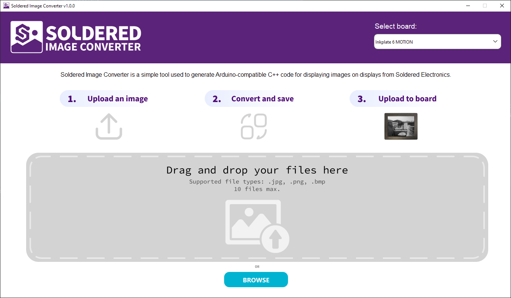
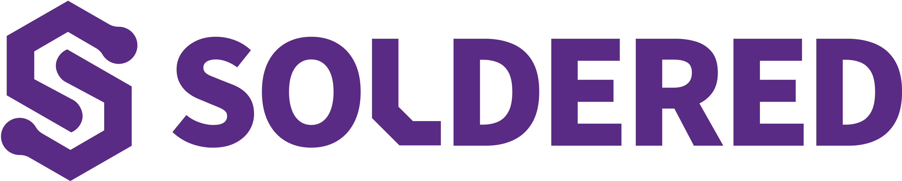

# Soldered Image Converter

## Overview

Soldered Image Converter is a desktop application which converts .png, .jpg, or .bmp format pictures (up to 10 at a time) to C++ compatible Arduino/Dasduino code, which you can use for your Soldered Displays. Now it's easy to convert images to byte arrays and display them on your embedded projects!

The app is written in Python, the GUI is made in PySide6 (QT Designer).

## Features

| Feature | Description                                |
| ------- |--------------------------------------------|
| **Image Formats** | .png, .jpg, .bmp                           |
| **Conversion Types** | 1-bit (black and white), 3-bit and 4-bit (grayscale) |
| **Editing Options** | Threshold, Dithering, Resize, Invert       |
| **Export** | Individual or bulk export                  |
| **Platforms** | Windows, Linux, Mac                        |

## Installation

Simply download the build for your platform, extract and run. Builds are [here](https://github.com/SolderedElectronics/Soldered-Image-Converter/releases).

## Compatibility

Currently, only conversion for Inkplate 6 MOTION, Inkplate 10, 6, 6PLUS and FLICK is available. All our other boards will be supported soon.

## Credit

For dithering, we are using the original code from [Utkarsh-Deshmukh/image-dithering-python](https://github.com/Utkarsh-Deshmukh/image-dithering-python). Thank you!

### About Soldered

At Soldered, we design and manufacture a wide selection of electronic products to help you turn your ideas into acts and bring you one step closer to your final project. Our products are intented for makers and crafted in-house by our experienced team in Osijek, Croatia. We believe that sharing is a crucial element for improvement and innovation, and we work hard to stay connected with all our makers regardless of their skill or experience level. Therefore, all our products are open-source. Finally, we always have your back. If you face any problem concerning either your shopping experience or your electronics project, our team will help you deal with it, offering efficient customer service and cost-free technical support anytime. Some of those might be useful for you:

- [Web Store](https://www.soldered.com/shop)
- [Tutorials & Projects](https://soldered.com/learn)
- [Community & Technical support](https://soldered.com/community)

### Open-source license

Soldered invests vast amounts of time into hardware & software for these products, which are all open-source. Please support future development by buying one of our products.

Check license details in the LICENSE file. Long story short, use these open-source files for any purpose you want to, as long as you apply the same open-source licence to it and disclose the original source. No warranty - all designs in this repository are distributed in the hope that they will be useful, but without any warranty. They are provided "AS IS", therefore without warranty of any kind, either expressed or implied. The entire quality and performance of what you do with the contents of this repository are your responsibility. In no event, Soldered (TAVU) will be liable for your damages, losses, including any general, special, incidental or consequential damage arising out of the use or inability to use the contents of this repository.

## Have fun!

And thank you from your fellow makers at Soldered Electronics.
